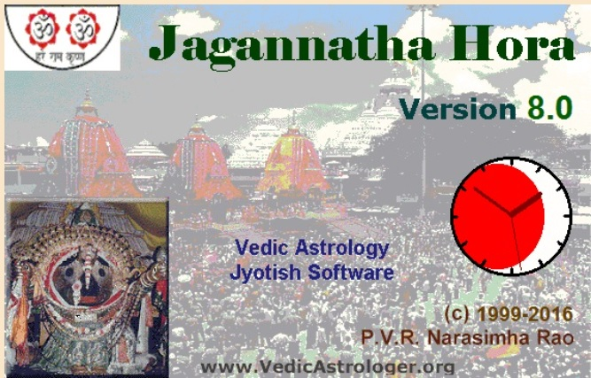

JHora 4.5.5
=================
Python package containing almost all the features described in the book

`Vedic Astrology - An Integrated Approach - by PVR Narasimha Rao`


and 

the free astrology software `Jagannatha Hora V8.0 software` by the same author.


 

This python library was inspired by his book and software. Almost all the results have been verified against the examples and exercises provided in the book. Also the features that are outside of his book but in his JHora software were collected from various internet sources and have been verified closest to results obtained using JHora software. 

There is a test module (`jhora.tests.pvr_tests`) containing about 6300 tests that can be run to verify the same. Please note the tests assume `const._DEFAULT_AYANAMSA_MODE='LAHIRI'`.

Having said that, if you find this package useful, all the credits go to Shri. P.V.R Narasimha Rao for such a wonderful book and the software and to the other internet sources.

Installation Requirements
-------------------------
This package is available in pypi.org

`pip install PyJHora`

IMPORTANT: From 3.6.6 onwards due to space limitations, the installation wheel/tar file will not contain the ephemeris data files. They should be copied from previous versions or directly from
`https://github.com/naturalstupid/pyjhora/src/jhora/data/ephe` folder 
Copy all the files from that folder to package installation directory `jhora/data/ephe`

Requirements
-------------

Python interface to Swiss ephemeris and Qt.

```
	pip install pyswisseph	# OR apt-get install pyswisseph
	pip install pyqt6       # OR apt-get install pyqt6
```
There are other dependencies listed in the file `requirements.txt` should be installed using `pip` if not already available.
There are four basic UI files namely: `panchangam.py`, `vedic_calendar.py`, `horo_chart_tabs.py` and `match_ui.py`.
`panchangam.py` - provides a one page panchanga information. `vedic_calendar.py` provides calendar for current month. 
`horo_chart_tabs.py`- provides multi-tab/page panchanga, divisional charts and `match_ui.py` - provides marriage compatibility between boy and girl based on their birh stars.

Using the Code / command line
------------------------------
Run the file: `jhora.ui.panchanga.py` in your Eclipse IDE

Or

```
	from jhora.ui.panchangam import Panchanga
	from jhora import utils
	import sys
	from _datetime import datetime
	from PyQt6.QtWidgets import QApplication
	def except_hook(cls, exception, traceback):
	    print('exception called')
	    sys.__excepthook__(cls, exception, traceback)
	sys.excepthook = except_hook
	App = QApplication(sys.argv)
   chart = Panchanga()
   chart.language('Tamil')
   chart.compute_horoscope()
   chart.show()
   sys.exit(App.exec())
```
Using the GUI
-------------

Enter Name, and Place with country name (e.g. Chennai, IN)
If you get an error, enter latitude, longitude and time zone manually.
If you want to be precise, enter the lat/long of the exact place (e.g. hospital)
You can use google to find the latitude, longitude, time zone of the place

Type the Date in YYY,MM,DD format in the 'Date' field. Negative value for YYYY are
interpolated as proleptic Gregorian calendar (Before Christ BC).

Enter Time of birth, choose chart style, ayanamsa mode, language of display

Click Show Chart to display the birth (Raasi and Navamsam) charts (every time any imput is changed)

Click Show PDF to save the screen as a PDF file


#### List of Features
* `jhora.ui.horo_chart_tabs`: 

This is the complex user interface PyQt tabbed Widget that can be used to get most of the features offered by this library. Language of UI can be dynamically changed. Various chart/panchanga/divisional chart/dhasa choices can be changed. Results can be saved as a PDF (about 100+ pages). Varnada Lagna and Sphuta to chart information.

Added right-click-context menu for all the chart widgets. Right click to view Arudhas, Upagrahas, Special Lagnas, Arudha Lagnas, Varnada Lagnas and Sphutas.

Added Chakra tab with choice varga chart to plot chakras such as 'kota', 'kaala', 'sarvatobadra', 'surya_kalanala', 'chandra_kalanala', 'shoola', 'tripataki'.

Added right-click menu "Prasna Lagnam" on Rasi/Varga Kundali Chart. Will show a dialog to select either Prasna Lagna 108 method or KP's 249 method or Naadi Prasna (1800). Choice to enter a number or random. Will show the Prasna Lagna Rasi in the chart.

Added KP-Adhibathi Tab to display KP No, Nakshathra Lord, Sub Lord, Pratyanthara Lord, Sookshma Lord, Praana Lord and Deha Lord.

Added chakras: Kaala and Kota, Sarvatobadra, Shoola, Tripataki, Surya Kalanala, Chandra Kalanala, Saptha Shalaka (aka Rahu Kalanala), Pancha Shalaka.

Added right-click menu Sahams.

Added color codes for Planets, Rasi, context menu items.

Added Paachaka Sambandha as right-click menu

Added Brahma, Rudra, Trishoola Rasi, Maheshwara as - right click menu

Added WidgetDialog to UI. Added Rasi/Graha Drishti to right-click menu

Added Saham Tab to UI.

Added Planet Speed info as right click menu

Added Pushkara Amsa/Bhaga info as right click menu

Added Graha Yudh and Mrityu Bhaga as right click menus (menu will appear only if applicable)

Added Planet Aspect Relationship table in UI and right click menu

Added Marana Karaka Sthana Planets as right click menu

Added Next/Prev lagna entry timing as right click menu

Added Lagna as one of the planets in `jhora.panchanga.drik` `previous_conjunction_of_planet_pair` and `next_conjunction_of_planet_pair` functions. Which means we can check conjunction between Lagna and any planets.

Added `next_planet_entry_date_divisional_chart`, `previous_planet_entry_date_divisional_chart`, `next_planet_entry_date_mixed_chart`, `previous_planet_entry_date_mixed_chart` to `jhora.horoscope.chart.charts` module.

Added Lattha Nakshathra as context menu

Added NadiAmsha (D-150) to Amsha Rulers List.

Added context menu to show 64th navamsa and 22nd drekkana (raasi and adhipathi)

Added planetary drekkana context menu for raasi chart

Added Sathyanarayana Puja, Durgashtami and Kaalashtami to the vratha list.

Added Sahasra Chandrodhayam to Panchangam page.

Added Pancha Pakshi Sastra Tab.

Fixed Gauri Chogadhiya function in `jhora.panchanga.drik`. Added gauri chogadhiya information in panchanga tab.

Added Nakshathra Amrtha Gadiya and Varjyam (Thyajyam) in panchanga tab.

Added Anandhaadhi Yoga to Panchanga tab.

Added Day/Night length to Panchanga tab.

Added `triguna` function to `jhora.panchanga.drik` and panchanga tab.

Added vivaha chakra palan

Added Shubha Hora to panchanga

Added Tamil Yogam, Brahma Muhurtha, Godhuli Muhurtha, Sandhya Kaala, Vijaya Muhurtha, Nishitha Kaala, Nishitha Muhurtha, Tamil Jaamams, Thaarabalam, Chandrabalam, Udhaya Lagna Muhurtham, Panchaka Rahitha functions to Panchanga

Added Nava/Special Thaara functions to `drik` and UI

Added Karaka tithi/yoga functions to `drik` and UI. Also Shiva Vaasa, Agni Vaasa, Pushkara/Aadal/Vidaal yogas, yogini vaasa, disha shool features added.

Added Vedic Clock feature (both VedicDigitalClock and VedicAnalogClock)

Added Vedic Calendar Widget

More ways of calculating `tamil_month_and_date` added. Default can be chosen from `const.tamil_month_method`

Added `drik.lunar_month_date(jd, place,use_purnimanta_system=False)`. This function can provide lunar month with Amantha and Purnimantha systems.

Added `drik.next_lunar_month`, `drik.next_lunar_year`, `drik.previous_lunar_month` and `drik.previous_lunar_year` functions.

* `jhora.ui.panchangam.vedic_valendar`: 

This is new since V4.4.0. UI Widget that provides Calendar for the month.

* `jhora.ui.panchangam`: 

This is new since V4.2.5. UI Widget that provides one page of all panchangam features. V4.4.0: Provides separate panchangam UI widgets `PanchangaInfoDialog` and `PanchangaWidget`.

* `jhora.ui.vedic_clock`: This widget provides Vedic Clock (`VedicDigitalClock` and `VedicAnalogClock`) and new since V4.3.5. `VedicDigitalClock` has class options: `show_local_clock=False, show_clock_caption=False, show_clock_label=True, horizontal_clocks=False`. Both also have `force_equal_day_night_ghati` option which if set to True - will force 30 ghatis each for day and night. This is an experimental feature, not sure if correct for a clock (while may be useful to to dive dinamaana or raathrimaana). By default it is False and ghati speed is calculated from today (day+night) duration divided by 60.

* `jhora.ui.pancha_pakshi_sastra_widget`: This module provides UI widget for Pancha Pakshi Sastra.

* `jhora.ui.chart_styles`: 

This module provides basic PyQt user interface Widgets for South, North, East Indian, Sudharshana Chakra and Western charts. Added WidgetDialog to UI.

* `jhora.ui.conjunction_dialog`: 

This module provides an independent user interface widget to calculate planet conjunctions.
* `jhora.ui.dhasa_bhkthi_options_dialog`: 

This module provides an independent user interface widget provide options for each dhasa type.
* `jhora.ui.mixed_chart_dialog`: 

This module provides an independent user interface widget to options of mixed charts.
* `jhora.ui.options_dialog`: 

This module provides an independent generic user interface widget provide chart/varnada options.
Added WidgetDialog to UI.

*`jhora.ui.chakra`:

This module provides Widgets for various types of chakras: Kaala and Kota, Sarvatobadra, Shoola, Tripataki, Surya Kalanala, Chandra Kalanala, Saptha Shalaka (aka Rahu Kalanala), Pancha Shalaka.

* `jhora.ui.match_ui`: 

This module provides an independent user interface widget to calculate marriage compatibility of boy/girl
* `jhora.ui.vakra_gathi`: 

This is just a fun plot widget to show how retrogression of a planet will appear as seen from the earth.
* `jhora.ui.vratha_finder`: 

This module provides an independent interface widget to find the vratha dates based on combination of inputs such as tithi, nakshathra, yogam, karana, tamil month.

* `jhora.panchanga.drik`: 

This is the basic module that offers functions for: setting one of 20 ayanamsa modes (Lahiri, KP, True Chitra etc), sunrise/set, moonrise/set, midday/night, day/night length, tithi,karana, yogam, raasi, nakshatra padha, vaara, lunar month, tamil month/date, elapsed year, new moon, samvasatra, ritu, gauri chogadiya, trikalam, durmuhurtham, abhijit muhurta, sidereal longitude of planets, dhasavarga longitude of planets, bhaava madhya, ascendant, declination of planets, longitudes of upagrahas (such as dhuma, vyatipaata, parivesha, indrachapa and upakethu, kaala, mrithyu, artha praharaka, yama ghantaka, gulika and maandi), special lagnas (such as bhava, hora, ghati, vighati, pranapada, indu, bhrigu bindhu, kunda, sree lagna), previous/next sankranti dates, previous/next solar entry dates, previous/next solar/lunar eclipse, birth rectification (BV Raman - experimental work - accuracy not guaranteed though), previous/next occurrence of planet pairs, previous/next planet entry into specified rasi, previous/next retrogression of planets and nisheka (does not match JHora values). 

Added `planets_speed_info` function to get Planets' latitude/longitude/distance and their speed information.

Added Graha Yudh calculation function `planets_in_graha_yudh` to find pairs of planets if in graha yudh

Added `next_ascendant_entry_date` abd `previous_ascendant_entry_date` functions to find lagna's entry to  next/previous raasi.

Added Lagna as one of the planets in `jhora.panchanga.drik` `previous_conjunction_of_planet_pair` and `next_conjunction_of_planet_pair` functions. Which means we can check conjunction between Lagna and any planet.

Added `graha_drekkana` function to calculate planetary drekkana for rasi chart.

Added Sahasra Chandrodhayam function `sahasra_chandrodayam(dob,tob,place)`

Fixed Gauri Chogadhiya function in `jhora.panchanga.drik`. Added gauri chogadhiya information in panchanga tab.

Added `amrita_gadiya` and `varjyam` functions to calculate respectively Amritha Gadiya and Varjya (Thyajya).

Added `anandhaadhi_yoga` function to calculate Anandhaadhi Yogam

Added `triguna` function to `jhora.panchanga.drik` and panchanga tab.

Added `vivaha_chakra_palan` to `jhora.panchanga.drik` and panchanga tab

added `shubha_hora` to `jhora.panchanga.drik` and panchanga tab

added `tamil_yogam(jd, place,check_special_yogas=True,use_sringeri_panchanga_version=False)` function to calculate 4 Tamil Yogama (Siddha, Amirth, MaraNa, Prabalarishta). It will also check for additional tamil yogams such as Amitha Siddha, Savaartha Siddha, Mrityu, Daghda, Yamaghata and Uthpatha. Please note Most panchangas don't specify additional category of the basic four yogas. Also some panchangas dont have Prabalarishta yogam (They are replaced with Marana yogam - e.g. Sringeri Panchangam)

Added `brahma_muhurtha(jd, place)`, `godhuli_muhurtha(jd, place)`, `sandhya_periods(jd,place)`, `vijaya_muhurtha(jd,place)`, `nishita_kaala(jd,place)`, `tamil_jaamam(jd,place)`, `nishita_muhurtha(jd,place)`, `thaaraabalam(jd,place,return_only_good_stars=True)`, `muhurthas(jd, place)`, `udhaya_lagna_muhurtha(jd,place)`, `chandrabalam(jd,place)`, and `panchaka_rahitha(jd,place)` functions.

Added `next_panchaka_days(jd,place)`, `chandrashtama(jd, place)`, `nava_thaara(jd,place,from_lagna_or_moon=0)`, `special_thaara(jd,place,from_lagna_or_moon=0)`, `karaka_tithi(jd,place)`, `karaka_yogam(jd,place)` and `fraction_moon_yet_to_traverse(jd,place,round_to_digits=5)` functions.

Added `shiva_vaasa(jd,place,method=2)` or `shiva_vaasa(jd,place,method=1)`, `agni_vaasa(jd,place)` functions.

Added `pushkara_yoga(jd, place)`, `aadal_yoga(jd, place)`, `vidaal_yoga(jd, place)`, `disha_shool(jd)` and `yogini_vaasa(jd,place)` features.

Added `lunar_month_date(jd, place,use_purnimanta_system=False)`. This function can provide lunar month with Amantha and Purnimantha systems.

Added `drik.next_lunar_month`, `drik.next_lunar_year`, `drik.previous_lunar_month` and `drik.previous_lunar_year` functions.

`drik.lunar_month_date(jd, place, use_purnimanta_system=False)` revised to return in addition lunar year index as last argument depending on whether the lunar month is amantha or purnimantha argument.

Added `vedic_date(jd,place,calendar_type)` to get solar/lunar month/day/year

Updated `tithi(jd,place)` to return adhik tithi of the day if it exists. Update `vedic_date(jd,place,calendar_type)` to include Adhik and Nija maasa booleans. Introduced an experimental function `next_tithi` to calculate next particular tithi occuring date/time. Added ayanamsa while calculating `declination_of_planets`. Added a lambda function `special_tithis(jd,place)` to compute all special tithis as a list.

* `jhora.panchanga.pancha_paksha`:

This module calculates pancha pakshi sastra.
NOTE: From V4.2.5 onwards UI widget (`PanchaPakshiSastraWidget`) has been moved to UI module.
 
* `jhora.horoscope.chart.arudhas`: 

Module to find Bhava and graha arudhas
* `jhora.horoscope.chart.ashtakavarga`: 

Module to find Ashtakavarga (Binna, Prastara and Samudhaya), Sodhaya Pinda
* `jhora.horoscope.chart.charts`: 

Module to find planet longitudes for rasi and each divisional charts(hora, drekkana, chaturthamsa, panchamsa, shashthamsa_chart, saptamsa, ashtamsa, navamsa, dasamsa, rudramsa, dwadasamsa, shodasamsa, vimsamsa, chaturvimsamsa, nakshatramsa, trimsamsa, khavedamsa, akshavedamsa, shashtyamsa, nava navamsa, ashtotharamsa and dwadas dwadasamsa), bhava chart, bhava houses [17 ways of calculating bhava houses such as equal housing, KP, Sripathi, Placidus, Koch, Porphyrius, Regiomontanus, Campanus, Equal (cusp 1 is Ascendant), Vehlow equal (Asc. in middle of house 1), axial rotation system, azimuthal or horizontal system, Polich/Page (topocentric system), Alcabitus and Morinus], get list of planets in retrogression/combustion, vaiseshikamsa (dhasavarga, shadvarga, sapthavarga, shodhasavarga), vimsopaka (dhasavarga, shadvarga, sapthavarga, shodhasavarga), varnadha lagna (using any of BV Raman, Sharma, Santhanam, Sanjay Rath/PVR Rao, Sitaram Jha/Prof. Ramachandra Pandey methods), malefics, benefics, planets in the order of kendras, amsa rulers (for each divisional chart).

Also added a function get mixed chart (for example D-9 followed by another D-9), customized kundali chart for any varga number in the range 1 to 300 (D-N is generated only for those vargas that are not tranditional such D-9, D144 etc)

Also added a function `planets_in_pushkara_navamsa_bhaga` to get list of planets that are in (i) pushkara amsa and (ii) in pushkara bhaga

Added `divisional_positions_from_rasi_positions` and `planets_in_mrityu_bhaga` functions

Added `get_planets_in_marana_karaka_sthana` function to calculate marana karaka sthana planets that returns list of [(planet,house),..]

Added `next_planet_entry_date_divisional_chart`, `previous_planet_entry_date_divisional_chart`, `next_planet_entry_date_mixed_chart`, `previous_planet_entry_date_mixed_chart` to `jhora.horoscope.chart.charts` module.

Added `lattha_stars_planets` function to find Lattha stars of the planets.

Added `get_64th_navamsa(navamsa_planet_positions)` and `get_22nd_drekkana(drekkana_planet_positions)` functions.

Hora chart default method (`chart_method`) changed to traditional Parasara.

Method `benefics_and_malefics` modified to consider Waxing/Waning moon and association of Mars with benefics/malefics. This is used in `strength.py` to calculate shadbala. 

* `jhora.horoscope.chart.dosha`: 

8 types of dosha (kala sarpa, manglik, pitru, guru chandala, ganda moola, kalathra, ghata, shrapit)
* `jhora.horoscope.chart.house`: 

Module to find trikonas, dushthanas, quadrants, kendras, chathsras, panaphras, apoklimas, aspected planets/rasis, upachayas, chara karakas, raasi/graha drishti, argala, virodhargala, stronger planet (from any two planets as arguments checking 7 rules), stronger rasi (from any two rasis as arguments checking 7 rules), natural/temporary friends/enemies, house owners (including Kethu/Saturn, Mars/Rahu combination), compound relation of planets, marakas, rudra, brahma, maheshwara, trishoola raasis, longevity type, associations of planets/raasis, baadhakas, aspecting planets/rasis and order of planets by strength from their positions/longitudes.
* `jhora.horoscope.chart.raja_yoga`: 

dharma_karmadhipati_raja_yoga, vipareetha_raja_yoga, neecha_bhanga_raja_yoga and a few other raja yogas.
* `jhora.horoscope.chart.sphuta`: 

Module to find sphutas such as tri, chathur, pancha, prana, deha, mrityu, sooshma tri, bheeja, kshetra, tithi, yoga, yogi, avayogi and rahu tithi.
* `jhora.horoscope.chart.strength`: 

Module to find various balas/strnegths of planet such as harsha bala, kshetra, sapthavargaja, sthana, ojayugama, kendra, dreshkon, uccha, uccha rashmi, hadda, drekkana, navamsa, pancha vargeeya, dwadhasa_vargeeya, dig, divaratri, nathonnath, paksha, tribhaga, abda, masa, vaara, hora, ayana, yuddha, kaala, ishta, subha, cheshta, cheshta rashmi, naisargika, drik, shad, bhava adhipathi, bhava dig, bhava drik, bhava drishti.

Modified shadbala calculations to match that of BVRaman and VPJain calculations. Added to tests to verify we get same results as theirs. Since each do calculations differently (different ayanamsa etc, different epoch), appropriate changes made. Please note that these calculations (with same date as theirs) will give different results in Jagannath Hora software. We are unware of the alogirithm used in JHora. Added `get_planet_mean_longitude(jd,place,planet_index=0)` to calculated planet mean longitude for calculating Cheshta bala.


Added `planet_aspect_relationship_table` function to get planet aspect relationship table based Parasara's Drik bala calculations.

Updated Shadbala calculations to fix the errors. Now the results match the calculations of VP Jain and BV Raman examples in their respective books. However, it is important to note, shadbala calculations does not match with JHora (even for these examples).

* `jhora.horoscope.chart.yoga`: 

Module to find about 100 yogas such as vesi, vosi, ubhayachara, nipuna, sunaphaa, anaphaa, duradhara, kemadruma, chandra_mangala, adhi, ruchaka, bhadra, sasa, maalavya, hamsa, rajju, musala, nala, maalaa, sarpa, gadaa, sakata, sringaataka, hala, vajra, yava, kamala, vaapi, yoopa, sara, sakti, danda, naukaa, koota, chatra, chaapa, ardha_chandra, chakra, samudra, veenaa, daama, paasa, kedaara, soola, yuga, gola, subha, asubha, gaja_kesari, guru_mangala, amala, parvata, kaahala, chaamara, sankha, bheri, mridanga, sreenaatha, matsya, koorma, khadga, kusuma, kalaanidhi, kalpadruma, lagnaadhi, hari, brahma, vishnu, siva, trilochana, gouri, chandikaa, lakshmi, saarada, bhaarathi, saraswathi, amsaavatara, devendra, indra, ravi, bhaaskara, kulavardhana, vasumati, gandharva, go, vidyut, chapa, pushkala, makuta, jaya, harsha, sarala and vimala.
* `jhora.horoscope.chart.dhasa.annual`: 

Module to find annual dhasas: (mudda, patyayini, varsha vimsottari, varsha narayana)
* `jhora.horoscope.chart.dhasa.graha`: 

Module to find 22 types of graha dhasas such as aayu, ashtottari, buddhi_gathi, chathuraaseethi_sama, dwadasottari, dwisatpathi, kaala, karaka, karana_chathuraaseethi_sama, naisargika, panchottari, saptharishi_nakshathra, sataatbika, shastihayani, shattrimsa_sama, shodasottari, tara, tithi_ashtottari, tithi_yogini, vimsottari, yoga_vimsottari, yogini. Each of these comes up applicable variations such as with/without antardhasa, with/without tribhagi variation, choice of starting nakshatra, choice of starting planet/lagna/special lagna/upagraha, choice of antardhasa sequence, choice of divisional chart etc. There is an `applicability` function to compute which of conditional dhasas are applicable for a given chart.
* `jhora.horoscope.chart.dhasa.raasi`: 

Module to find 22 types of raasi dhasas such as brahma, chakra, chara, drig, kalachakra, kendradhi_rasi, lagnamsaka, mandooka, moola, narayana, navamsa, nirayana, padhanadhamsa, paryaaya, sandhya, shoola, sthira, sudasa, tara_lagna, trikona, varnada, yogardha. Each of these comes up applicable variations such as with/without antardhasa, with/without tribhagi variation, choice of starting nakshatra, choice of starting planet/lagna/special lagna/upagraha, choice of antardhasa sequence, choice of divisional chart  etc.
* `jhora.horoscope.chart.dhasa.sudharsana_chakra`: 

Module to calculate sudharsana chakra dhasa with choice of divisional chart.
* `jhora.horoscope.chart.dhasa.match.compatibility`: 

Module to calculate marriage compatibility between boy/girl stars, with south/north indian variations.
* `jhora.horoscope.chart.prediction.general`: 

Module to calculate general predictions based on lagna rasi, planets in houses, lords in houses
* `jhora.horoscope.chart.prediction.longevity`: 

Module to calculate longevity range (baladrishta, alpayu, madhyayu and pooranyu checks - THIS IS UNDER EXPERIMENT - PLEASE DO NOT USE IT YET)
* `jhora.horoscope.chart.prediction.naadi_marriage`: 

Module to calculate marriage yogas using naadi approach - THIS IS UNDER EXPERIMENT - PLEASE DO NOT USE IT YET)
* `jhora.horoscope.transit.saham`: 

Module to find 36 sahams such as punya, vidya, yasas, mitra, mahatmaya, asha, samartha, bhrartri, gaurava, pitri, rajya, mathri, puthra, jeeva, karma, roga, kali, sastra, bandhu, mrithyu, pardesa, artha, paradara, vanika, karyasiddhi, vivaha, santapa, sraddha, preethi, jadya, vyaapaarasathru, jalapatna, bandhana, apamrithyu, and laabha.
* `jhora.horoscope.transit.tajaka_yoga`: 

Module to find various tajaka (annual) yogams such as ishkavala, induvara, ithasala, eesarpha, nakta, yamaya, manahoo, kamboola, radda and duhphali_kutta. 
* `jhora.horoscope.transit.tajaka`: 

Module to find various tajaka aspects such as: munda,trinal/square/sextile/semi-sextile aspects of raasi/planet,  neutral/benefic/malefic/opposition/conjunction aspects of raasi/planet, planets/raasis/houses with neutral/benefic/malefic aspects on planets/raasis/houses, varsha pravesh (aka annual chart), maasa pravesh (aka monthly chart), sixty_hour chart, lord of the year/month/sixty-hour, check if planets within their deeptamsa, check if planets are approaching.
* `jhora.panchanga.khanda khaadyaka` and `jhora.panchanga.surya_sidhantha`: 

Modules `khanda khaadyaka`, `surya_sidhantha` are attempts to implement ancient methodolgies of astrology  - THIS IS UNDER EXPERIMENT - PLEASE DO NOT USE IT YET)
* `jhora.panchanga.vratha`: 

Module to find various vratha dates such as pradosham, sankranti, amavasya, pournami, ekadhashi, sashti, sankatahara_chathurthi, vinayaka_chathurthi, shivarathri, chandra_dharshan, moondraam_pirai, srartha, ashtaka, manvaadhi, yugadhi, mahalaya_paksha. There is also a `search` function to find dates matching any combination of tithi, nakshathra, yogam, karana, tamil month.

Added Sathyanarayana Puja function `sathyanarayana_puja_dates`, Durgashtami (`durgashtami_dates`) and Kaalashtami  (`kaalashtami_dates`) to the vratha list.


Package Structure:

```
jhora
   !- data       - contains program configuration data, world cities data, marriage compatibility table
         !- ephe - contains swiss ephimeride compressed JPL data
   !- images     - contains images
   !- lang       - contains language resource files
   !- panchanga  - panchanga module to calculate daily panchanga
   		!- drik.py - all panchanga functions such as sunrise to planet positions
   		!- drik1.py - panchanga functions through Calendar Class - !!! NOT FULLY IMPLEMENTED !!!
   		!- khanda_khaadyaka.py - planet positions using khanda khaadyaka method - !!! NOT FULLY IMPLEMENTED !!!
   		!- surya_sidhantha.py - planet positions using surya sidhantha method - !!! NOT FULLY IMPLEMENTED !!!
   		!- vratha.py  - to find speacial vratha days such as amavasya, srartha etc
   !- horoscope
        !- main.py - horoscope package (used mainly by the UI programs)
        !- chart  - chart package
           !- arudhas.py     - arudhas, argala, virodhargal
           !- ashtavarga.py  - ashtavarga, trikona sodhana, ekadhipatya_sodhana, sodhaya pinda
           !- charts.py      - divisional charts, planet combustion, retrograde
           !- dosha.py       - doshas
           !- house.py       - aspects, drishti,stronger planets/raasi, kaarakas
           !- raja_yoga.py   - raja_yoga and its sub-types
           !- sphuta.py      - sphutas: tri, chatu, pancha, prana, deha, mrityu, sooshma tri, beeja, kshetra, tithi, yoga, rahu tithi.
           !- strength.py    - Harsha, Pancha Vargeeya, Dwadhasa Vargeeya, Shad bala, Bhava bala
           !- yoga.py        - 100+ yogas
        !- dhasa  - dhasa package
        	! sudharsan_chakra.py - Sudarshana Chakra dhasa-bhukthi
              ! - annual - Annual Dhasa package
                 !- mudda.py  	  - mudda dhasa-bhuthi
                 !- patyayini.py   - patyayini dhasa-bhukthi
              ! - graha - Graha Dhasa package
              	!- aayu.py        - aayu dhasa-bhukthi
                 !- ashtottari.py  - ashtottari dhasa-bhukthi
                 !- buddhi_gathi.py - Buddhi Gathi dhasa bhukthi
                 !- chathuraseethi_sama.py - chathura seethi sama dhasa
                 !- dwadasottari.py - dwadasottari dhasa
                 !- dwisapathi.py  - dwisatpathi dhasa
                 !- kaala.py       - kaala dhasa
                 !- karaka.py      - karaka dhasa
                 !- karana_chathuraseethi_sama.py - karana chathura seethi sama dhasa
                 !- naisargika.py  - naisargika dhasa
                 !- panchottari.py - panchottari dhasa-bhukthi
                 !- saptharishi_nakshathra.py - Saptharishi Nakshathra dhasa-bhukthi
                 !- sataatbika.py  - sataatbika dhasa-bhukthi
                 !- shastihayani.py - shastihayani dhasa-bhukthi (also called Shashti Sama dasa)
                 !- shattrimsa_sama.py - shattrimsa sama dhasa-bhukthi
                 !- shodasottari.py - shodasottari dhasa bhukthi
                 !- tara.py        - tara dhasa-bhuthi
                 !- tithi_ashtottari.py  - tithi ashtottari dhasa-bhuthi
                 !- tithi_yogini.py  - tithi yogini dhasa-bhuthi
                 !- vimsottari.py  - vimsottari dhasa-bhuthi
                 !- yoga_vimsottari.py  - yoga vimsottari dhasa-bhuthi
                 !- yogini.py      - yogini dhasa-bhuthi
           ! - raasi - Raasi Dhasa Package
                 !- brahma.py      - brahma dhasa
                 !- chakra.py       - chakra dhasa
                 !- chara.py       - chara dhasa
                 !- drig.py        - drigdhasa-bhuthi
                 !- kalachakra.py  - kalachakra dhasa-bhuthi
                 !- kendradhi_rasi.py - kendradhi rasi dhasa
                 !- lagnamsaka.py     - lagnamsaka dhasa
                 !- mandooka.py      - mandooka dhasa
                 !- moola.py       - moola dhasa-bhuthi (Also called Lagna Kendradi Rasi Dhasa)
                 !- narayana.py    - narayana dhasa-bhuthi
                 !- navamsa.py     - navamsa dhasa-bhuthi
                 !- nirayana.py    - nirayana dhasa-bhuthi
                 !- padhanadhamsa.py - padhanadhamsa dhasa-bhukthi
                 !- paryaaya.py    - Paryaaya dhsasa-bhukthi
                 !- shoola.py      - shoola dhasa-bhukthi
                 !- sthira/py      - sthira dhasa bhukthi
                 !- sudasa.py      - sudasa dhasa-bhuthi
                 !- tara_lagna.py   - tara lagna dhasa-bhuthi
                 !- trikona/py     - trikona dhasa-bhuthi
                 !- varnada.py	  - varnada dhasa-bhuthi
                 !- yogardha.py    - yogardha dhasa-bhuthi
        !- match  - marriage compatibility package
           !- compatibility.py  - marriage compatibility
        !- prediction  - basic prediction package
           !- general.py  - general prediction - experimental work
           !- longevity.py - longevity predictions - experimental work
           !- naadi_marriage.py - maadi marriage predictions - experimental work
        !- transit  - tajaka package
           !- tajaka.py      - annual, monthly and 60 hour charts, muntha, vargeeya balas, tajaka lord 
           !- tajaka_yoga.py - tajaka yogas
           !- saham.py       - 36 sahams
   !- ui  - user interface package
      !- chakra.py             - UI for chakras
      !- dhasa_bhukthi_options.py	- UI for dhasa bhukthi options
      !- mixed_chart_dialog.py - UI for mixed chart options
      !- varga_chart_dialog.py - UI for Varga Chart options
      !- horo_chart.py         - simple horoscope chart Raasi/Navamsa and calendar information
      !- panchangam.py         - UI for panchangam information
      !- pancha_pakshi_sastra_widget.py - UI for Pancha Pakshi Sastra
      !- horo_chart_tabs.py    - horoscope with lot of details
      !- match_ui.py           - ui for marriage compatibility
      !- chart_styles.py       - Widget class for kundali chart style
      !- label_grid.py         - Widget for custom table of QLabels
      !- vakra_gathi_plot.py        - fun plot of retrogession of planet as seen from earth
      !- vratha_finder.py      - Widget for finding vratha dates
      !- conjunction_dialog.py - Widget for finding conjunction dates of planets
      !  vedic_calendar.py     - Widget for Vedic Calendar-
      !- vedic_clock.py        - Widget for Vedic Clock
   !- utils.py             - utility functions
   !- const.py             - constants related to PyHora package        
   !- tests  - unit/integration tests
      !- unit_tests.py           - unit tests for the features based on examples from the book
      !- pvr_tests.py            - Exercise problems from book.
```
Changes since 4.5.0
===================
* some error fixes (e.g. using planet positions to find maheshwara)
* Added argument `skip_varna_checking=const.skip_using_girls_varna_for_minimum_tamil_porutham` to `jhora.horoscope.match.compatibility` `_is_there_minimum_tamil_porutham`
* Added festival data as a csv file under data folder: `hindu_festivals_multilingual_unicode_bom.csv`. Added functions `get_festivals_between_the_dates`, `get_festivals_of_the_day`, `get_festival` to `jhora.panchanga.vratha` to find festivals from the csv file. Updated UIs `jhora.ui.vedic_calendar`, `jhora.ui.vratha_finder`, `jhora.ui.horo_chart_tabs` to support search and display festivals as icons and today's festivals.
* `tithi_using_inverse_lagrange` function of `panchanga.drik` updated to provide two tithis if they appear on same day.

Changes since 4.4.5
===================
Updated `tithi(jd,place)` to return adhik tithi of the day if it exists.

Updated Shadbala calculations to fix the errors. Now the results match the calculations of VP Jain and BV Raman examples in their respective books. However, it is important to note, shadbala calculations does not match with JHora (even for these examples). Added tests to VP Jain/ BV Raman book examples.

Fixed encoding error in `utils.py`

Added special tithis to Panchangam page.

Changes since 4.4.0
===================
Fixed errors in resource lists of Telugu, Kannada and Hindi

Added `lunar_month_date(jd, place,use_purnimanta_system=False)`. This function can provide lunar month with Amantha and Purnimantha systems. Vedic Calendar Widget updated to support these systems.

Added Malayalam language.

To load world cities, earlier versions used Pandas but users have said, it consumed 25+GB memory. From this version onwards, csv is used to read and write the world cities data. Performance has improved.

Added `drik.next_lunar_month`, `drik.next_lunar_year`, `drik.previous_lunar_month` and `drik.previous_lunar_year` functions.
`drik.raasi(jd,place)` end time return value changed from string to float hours
`drik.lunar_month_date` revised to return in addition lunar year index as last argument

Added `drik.vedic_date(jd,place,calendar_type)` to get solar/lunar month/day/year

Changes since 4.3.5
===================
Refactored `utils` by removing global variables replaced with `setattr`

Added Vedic Calendar Widget

More ways of calculating `tamil_month_and_date` added. Default can be chosen from `const.tamil_month_method`


Changes since 4.3.1
===================
Added `pushkara_yoga(jd, place)`, `aadal_yoga(jd, place)`, `vidaal_yoga(jd, place)`, `disha_shool(jd)` and `yogini_vaasa(jd,place)` features.

Added Vedic Clock feature (both VedicDigitalClock and VedicAnalogClock)

Added an option to `show_vedic_clock` option to `jhora.ui.panchangam.Panchanga` class. The class default is False but if panchangam.py is executed it is initiated with True.

Changes since 4.2.5
====================
Due to error in Karana calculations, revised `jhora.panchanga.drik.karana` function. Till V4.2.5, karana was working for one half of tithis.

Added chandrashtama, karaka yoga/tithi, nava/special thaara, fraction_moon_yet_to_traverse and next panchaka days features.

Rewritten `jhora.panchanga.drik` functions `nakshatra(jd,place)`, `tithi(jd,place`, `yogam(jd,place` functions (they are now calculated using Moon/Sun/Planet speeds). `tithi` and `yogam` also now support using planets other than Moon and Sun for calculating tithi or yogam. Prior methods using Inverse Lagrange are left with `_old` suffixes. One can switch to using inverse lagrange by setting `const.use_planet_speed_for_panchangam_end_timings=False`

`yogam(jd,place,tithi_index=1,planet1=const._MOON,planet2=const._SUN,cycle=1)`
`tithi(jd,place,tithi_index=1,planet1=const._MOON,planet2=const._SUN,cycle=1)`
tithi_index can be 1 to 12 (for Janma tithi to Vyaya tithi) and cycle can be 1 to 3. Please note Cycle=1 to 3 results do not match with JHora. To support this changes made to `vratha.py`, `main.py` and the UI code.

New Lambda functions `daily_moon_speed`, `daily_sun_speed` and `daily_planet_speed` added to `drik.py`

`_panchanga_tests` commented out in `pvr_tests.py` - They dont pass because they are using (0,0,0) as time. Need to fix this in future.

`horo_chart` errors fixed somewhat. There can be more errors in this UI. Will fix in future. Till then use the UIs `panchangam` and `horo_chart_tabs` only.

End timings of Nakshathra, Yogam, Karanam using old methods have been fixed. Both old and new methods now should be close to each other. Also fixed Trikaalam, durmurtham timings.

Added more panchanga features: see `jhora.panchanga.drik` for details.
Added `brahma_muhurtha(jd, place)`, `godhuli_muhurtha(jd, place)`, `sandhya_periods(jd,place)`, `vijaya_muhurtha(jd,place)`, `nishita_kaala(jd,place)`, `tamil_jaamam(jd,place)`, `nishita_muhurtha(jd,place)`, `thaaraabalam(jd,place,return_only_good_stars=True)`, `muhurthas(jd, place)`, `udhaya_lagna_muhurtha(jd,place)`, `chandrabalam(jd,place)`, and `panchaka_rahitha(jd,place)` functions.

Added `next_panchaka_days(jd,place)`, `chandrashtama(jd, place)`, `nava_thaara(jd,place,from_lagna_or_moon=0)`, `special_thaara(jd,place,from_lagna_or_moon=0)`, `karaka_tithi(jd,place)`, `karaka_yogam(jd,place)` and `fraction_moon_yet_to_traverse(jd,place,round_to_digits=5)` functions.

Added `shiva_vaasa(jd,place,method=2)` or `shiva_vaasa(jd,place,method=1)`, `agni_vaasa(jd,place)` functions.

Changes since 4.2.0
====================
Added Tamil Yogam feature. Wrong import in `chakra.py` removed. 

Separated pancha paksha code to ui and backend.

Added Tamil Yogam, Brahma Muhurtha, Godhuli Muhurtha, Sandhya Kaala, Vijaya Muhurtha, Nishitha Kaala, Nishitha Muhurtha, Tamil Jaamams, Thaarabalam, Chandrabalam, Udhaya Lagna Muhurtham, Panchaka Rahitha functions to Panchanga

Added UI Widget that provides one page of all panchangam features.

Changes since 4.0.3
====================
Fixed Prasna Lagna not appearing in chart when its context menu is clicked.

Added `lattha_stars_planets` function to find Lattha stars of the planets.

Added context menu to show 64th navamsa and 22nd drekkana (raasi and adhipathi)

Removed redundant call to `get_horoscope_information` from `main.py` (as we call `get_horoscope_information_for_chart` for each chart. Improves UI startup a bit.

Fixed error calculating of Lattha Stars. 

Added `graha_drekkana` function to calculate planetary drekkana for rasi chart. Also as right click menu for raasi chart.

Added Sathyanarayana Puja function `sathyanarayana_puja_dates`, Durgashtami (`durgashtami_dates`) and Kaalashtami  (`kaalashtami_dates`) to the vratha list.

Added Sahasra Chandrodhayam to panchangam page and as a function `jhora.panchanga.drik.sahasra_chandrodayam(dob,tob,place)`

Added module `jhora.panchanga.pancha_paksha`. This module calculates pancha pakshi sastra. This module also provides a widget (`PanchaPakshiSastraWidget`) that allows to enter date/time at which pancha sastra to be shown based on birth star details.

Fixed Gauri Chogadhiya function in `jhora.panchanga.drik`. Added gauri chogadhiya information in panchanga tab.

Added `amrita_gadiya` and `varjyam` functions to calculate respectively Amritha Gadiya and Varjya (Thyajya) in `jhora.panchanga.drik`.

Added `anandhaadhi_yoga` function to calculate Anandhaadhi Yogam in `jhora.panchanga.drik`.

Added Day/Night length to Panchanga tab.

Added `triguna` function to `jhora.panchanga.drik` and panchanga tab.

Added `vivaha_chakra_palan` to `jhora.panchanga.drik` and panchanga tab

Added `shubha_hora` to `jhora.panchanga.drik` and panchanga tab

Changes since 3.9.3
====================
Added planet relationship table as right click menu as well as `planet_aspect_relationship_table` function in `jhora.horoscope.chart.strength.py` 

Fixed errors in calling yogam across drik.py, pvr_tests.py and yoga_vimsottari.py

Added `get_planets_in_marana_karaka_sthana` function to calculate marana karaka sthana planets that returns list of [(planet,house),..]. Added this as a right click menu as well.

Added `next_ascendant_entry_date` abd `previous_ascendant_entry_date` functions to find lagna's entry to  next/previous raasi.

Added `next_planet_entry_date_divisional_chart`, `previous_planet_entry_date_divisional_chart`, `next_planet_entry_date_mixed_chart`, `previous_planet_entry_date_mixed_chart` to `jhora.horoscope.chart.charts` module.

Fixed some errors in UI and test modules.

Changes since V3.8.6
=====================
Added Brahma, Rudra, Trishoola Rasi, Maheshwara as - right click menu

Added WidgetDialog to UI. Added Rasi/Graha Drishti to right-click menu

Added Saham Tab to UI. Fixed Tab-Names and a few errors

Fixed `horoscope.panchanga.drik` yogam to return 1..27 instead of 0..26. Added `planets_speed_info` function to get planets' latitude/longitude/distance from earth and their speed information.

Added Planet Speed info as right click menu

Added Pushkara Amsa/Bhaga as a function in `jhora.horoscope.charts` and as a right click menu

Added `planets_speed_info` function to get Planets' latitude/longitude/distance and their speed information.

Added Graha Yudh calculation function `planets_in_graha_yudh` to find pairs of planets if in graha yudh

Added Mrityu Bhaga calculation function and added as right click menu

Changes since V3.8.3
=====================
Added right-click menu Sahams.

Added color codes for Planets, Rasi, context menu items.

Fixed Western Chart error.

Added Paachaka Sambandha as right-click menu

Changes since V3.8.0
=====================
Fixed chart title of conjuntion,transit, vkaragathi dialogs.

Fixed error message of the above dialogs.

Minor custom label adjustments in chakra UI. (Fixed Planets that were wrongly placed under Abihijit due to abhijit order of stars used in Chakra charts).

Added KP-Adhibathi Tab to display KP No, Nakshathra Lord, Sub Lord, Pratyanthara Lord, Sookshma Lord, Praana Lord and Deha Lord.

Added chakras: Kaala and Kota, Sarvatobadra, Shoola, Tripataki, Surya Kalanala, Chandra Kalanala, Saptha Shalaka (aka Rahu Kalanala), Pancha Shalaka, Saptha Naadi.

`jhora.utils` and `jhora.const` - added KP, Prasna related functions and constants.

Changes since V3.7.8
=====================
Added right-click menu "Prasna Lagnam" on Rasi/Varga Kundali Chart. Will show a dialog to select either Prasna Lagna 108 method or KP's 249 method or Naadi Prasna (1800). Choice to enter a number or random. Will show the Prasna Lagna Rasi in the chart.

Changes since V3.7.0-post1
=====================
Added Chakra tab with choice varga chart to plot chakras such as 'kota', 'kaala', 'sarvatobadra', 'surya_kalanala', 'chandra_kalanala', 'shoola', 'tripataki'.

Errors in 3.7.0 UI - fixed. Added Sphuta and Varnada Lagna for right click and chart information.
Errors fixed due to additional arguments to support custom and mixed charts across the package.
Unit Tests successfully executed.

`jhora.horoscope.chart.arudhas`: Bhava arudhas can be obtained from any base planet. `bhava_arudhas_from_planet_positions` takes an argument `arudha_base` 0=> Lagna, 1=>Sun...9=>Ketu

`jhora.horoscope.chart.charts`: Updated special lagnas, planets to be obtained for standard, custom and mixed charts. 

`jhora.horoscope.main`:  Changes to support right click menu and other UI elements.

`jhora.panchanga.drik`: Updated special lagnas, planets to be obtained for standard, custom and mixed charts.

`jhora.ui.horo_chart_tabs`: Added right-click context menus on Kundali Charts.

Changes since V3.6.6
=====================
Custom Kundali Chart (Dn) and Sub-divisional (mixed) (DmxDn) charts added to `jhora.horoscope.chart.charts`
And changes to `jhora.horoscope.main`, `jhora.tests.pvr_tests` and `jhora.ui.horo_chart_tabs` to support the custom and mixed kundali charts.

Changes since V3.5.8
=====================
Mostly - added to support different methods for each chart type. Corresponding `chart_method` argument added throughout the library as well as in `jhora.ui.horo_chart_tabs`

Some error fixes throughout the library while adding the above changes

Changes since V3.4.0
=====================
* horoscope/chart/charts: Amsa rulers, Bhava Chart, Bhava houses (using several methods such as Equal Housing, Sripati, KP, Placidus, Koch, Porphyrius, Regiomontanus, Campanus, Alcabitus, Morinus), Vaiseshikamsa varga bala, various methods of varnada lagna added.
* horoscope/chart/house: Lagna included to be considered as a planet in stronger_planet functions.
* horoscope/chart/strength: ishta phala, uccha rashmi, chesta rashmi, subha rashmi
* horoscope/chart/dhasa: Except mudda every dhasa default year duration changed to sidereal year. For all dhasas, where applicable, additional variation options have been added such as tribhaga, different positions from moon, 12 possible tithis, such as 1=>Janma Tithi 2=>Dhana 3=>Bhratri, 4=>Matri 5=Putra 6=>Satru 7=>Kalatra 8=>Mrutyu 9=>Bhagya 10=>Karma 11=>Laabha 12=>Vyaya ,  in case of tithi ashtottari dhasa, dhasas for all divisional charts etc. Some dhasas also options as arguments as calculated by various astrologers.
* panchanga/drik.py: Uranus, Neptune, Pluto are added to charts by default. `tithi` function updated to optionally get 12 tithis such as 1=>Janma Tithi 2=>Dhana 3=>Bhratri, 4=>Matri 5=Putra 6=>Satru 7=>Kalatra 8=>Mrutyu 9=>Bhagya 10=>Karma 11=>Laabha 12=>Vyaya. A general experimental function `__get_general_tithi` where any two planets including lagna can be used to find a general tithi based on their longitude differences. Function to find `bhaava_madhya` added.
* ui/horo_chart_tabs.py - updated to reduce tabs and add comboboxes to select various charts or dhasa options.


Changes since V3.3.0
=====================
* ** horoscope/dhasa folder restructured with dhasas moved to graha/raasi/annual folders under it.**
* const.py, horoscope/chart/charts.py, horoscope/chart/dhasa/varnada.py horoscope/main.py - Varnada lagna added for all charts. ** Experimental functions to calculate varnada using BV Raman, Santhanam and Sanjay Rath methods ***
* horoscope/dhasa/graha/vimsottari.py - sidereal year is used instead of savana year. Added option `use_rasi_bhukthi_variation` setting True will generate Rasi-Bhukthi Vimsottari Dhasa.
* For all applicable dhasa, added option `use_tribhagi_variation` to generate tribhagi variation.
* Added buddhi\_gathi, karana\_chathuraaseethi\_sama, tithi\_ashtottari, tith\_yogini, kaala and yoga\_vimsottari graha dhasas. Also added chakra rasi dhasa.4
* horoscope/dhasa/varnada.py - Error Fixed. Passed divisional_chart_factor argument correctly.
* horoscope/charts/sphuta.py - Added yogi and avayogi sphuta
* tests/pvr_tests.py - Added tests for yogi and avayogi sphuta and all added dhasas.
* panchanga/drik.py - Added vighati and pranapada lagna. Updated `yogam` and `karanam` functions to return start and end times as well.
* ui/horo\_chart\_tabs.py - Updated to cover above changes

Changes since V3.2.0
=====================
* horoscope/main.py- and panchanga/drik.py - Added fraction left for tithi/nakshathra. ** Added drik.`planets_in_retrograde` function. This calculates planet retrogression correctly.  Do not use `planets_in_retrograde` from charts module **
* panchanga/drik.py - Added functions to calculate conjunctions of planets, or in general separation by angles in multiples of 30°. Added functions to calculate Planet Entry/Transit dates. Added function `_nisheka_time` to calculate conception date/time. ** This is still not accurate as compared to JHora. I could not get exact algorithm to calculate this yet. I am still experimenting this **
* ui/horo\_chart\_tabs.py - added UI to be able to select planetary conjunction calculation or planet transit calculation. Minor change: Added resource strings for language combo and chart type combo. 
* ui/vakra\_gathi_plot.py - ** New UI to show retrograde path of planets as seen from earth. **
* ui/vratha\_finder.py: New UI to find vrathas such as pradosham, sankranti, amavasya, pournami', ekadhashi, sashti, sankatahara\_chathurthi, vinayaka\_chathurthi, shivarathri, chandra\_dharshan, moondraam\_pirai, srartha, tithi, nakshatra, ashtaka, manvaadhi, yugadhi, mahalaya\_paksha.
* tests/pvr\_tests.py - added tests for conjunction and transit feature to compare against JHora.

Changes since V3.1.8
=====================
* panchanga/vratha.py - added `tithi_pravesha` function to find dates/times of tithi/lunar\_month as that of given birth\_date, birth\_time and birth\_place - found between the given start and end dates.
* ui/horos\_chart\_tabs.py - added `tithi_pravesha` ComboBox. One can choose either Annual Pravesha (solar entry for current year) or Tithi Pravesha (lunar month/tithi entry for current year).

Changes since V3.0.5
=====================
* Data: Added: south indian marriage compatibility csv database file, Marriage_Compatibility-V4.0.1.xlsx
* horoscope/chart/charts.py - `benefics_and_malefics` function to calculate benefics/malefics based on tithi and planet associations.
* horoscope/chart/dosha.py - new module to calculate various doshas: kala sarpa, manglik/sevvay, pitru, guru chandala, ganda moola, kalathra, ghata and shrapit.
* horoscope/chart/house.py - added functions `aspected_planets_of_the_planet`, `aspected_rasis_of_the_planet`, `aspected_houses_of_the_planet`, `planets_aspecting_the_planet`, `associations_of_the_planet` and `baadhakas_of_raasi` 
* horoscope/chart/raja_yoga.py - minor changes: getting benefics/malefics from charts.py instead of const.py
* horoscope/chart/sphuta.py - sphuta functions return constellation and longitude within constellation.
* horoscope/chart/strength.py - minor changes: getting benefics/malefics from charts.py instead of const.py
* horoscope/match/compatibility.py - Major change: Introduce South Indian (பத்து பொருத்தம்) in addition to existing Ashta Koota. Also automatically checks if dina/gana/yoni/rasi and rajju are matching - depending on the varna of the girl rasi.
* horoscope/transit/saham.py - renamed `_is_C_between_B_to_A`
* horoscope/prediction.py - provides general predictions based on lagna raasi, planets in houses and lords in houses.
* lang/ - Added language strings for dosha, prediction. ** Please note that translations are based on google translate and hence may not be accurate - for example the word native is translated as "பூர்வீகம்". **
* panchanga/drik.py - `_rise_flags` changed to `swe.BIT_HINDU_RISING`. Added new functions  `next_solar_eclipse(jd,place)` and `next_lunar_eclipse(jd,place)` to calculate next solar/lunar eclipse dates.
* ui/ - added changes to support south indian compatibility
* const.py - added constants related to dosha and compatibility
* utils.py - added array lists to support dosha and compatibility.

** PLEASE NOTE OTHER README.MD FILES INSIDE PACKAGE ARE NOT UPDATED YET **

Major Changes since V2.6.9
==========================
* Divisional chart calculations were incorrect in V2.6.9 or before. They have been fixed now
* Several new dhasa have been added. (14 Graha Dhasa, 19 Rasi Dhasa and 3 Annual Dhasa)
* Graha / Nakshatra Dhasas: 
    * vimsottari, ashtottari, yogini, shodasottari, dwadasottari, dwisatpathi, panchottari, satabdika, chaturaaseeti sama, shashtisama, shattrimsa sama, naisargika, tara, karaka
* Raasi Dhasas:
    * narayana, kendraadhi_rasi, sudasa, drig, nirayana, shoola, kendraadhi karaka, chara, lagnamsaka, padhanadhamsa, mandooka, sthira, tara lagna, brahma, varnada, yogardha, navamsa, paryaaya, trikona, kalachakra
* Annual Dhasas:
    * patyayini, varsha vimsottari, varsha narayana

* Stronger Planet and Rasi are now calculated using planet positions and longitudes (in V2.6.9 or before it was only based on planet houses)

Computation of the five essentials of the panchangam:
* Tithi
* Nakshatra
* Yoga
* Karana
* Vaara

Not just the values, but also the end times of tithis and nakshatras
are computed. The only factor limiting the accuracy of the program
output is the uncertainity in your input values (latitude, longitude).

Also includes computation of sunrise, sunset, moonrise and moonset.

Also Included :
* Instantaneous planetary positions, including Lagna (Ascendant)
* Navamsa positions
* Choghadiya/Gauri panchanga
* Vimsottari Dasha-Bhukti
* Rahu Kala, Yamaganda Kala, Gulika Kala
* Abhijit muhurta and Durmuhurtams
* Marriage compatibility details (0.9.6)
* Special Lagnas and Upagrahas added to charts (1.0.1)
* Ashtaka Varga charts and Shodhya pinda(0.9.8)
* Print the UI as PDF (using img2pdf and pillow to combine two tabs into one page)

Available in English, Tamil and Telugu, Hindi(0.9.7) and Kannada (0.9.8)
-------------------------------------------------------------------------

You can add your own language by creating `list_values_xx.txt` and `msg_strings_xx.txt`	by copying the _en files and replacing with appropriate native language strings.

Do not forget to add the new language into the `available_languages` in `horo_chart.py` and/or `horo_chart_tabs.py`

NOTE:
All timings are end timings. Timings displayed higher than 24:00 denote
hours past midnight because the Hindu day (tithi) starts and ends with
sunrise. If applicable, daylight savings (DST) are accounted for
automatically based on the date and place entered in the textboxes.


Accuracy
--------

The program is as accurate as the Swiss Ephemeris installed on your system. So generally it is
accurate for years 13000 BCE to 16800 CE. The computational speed stays the same no matter which date you enter. Required swiss ephimeres files are also in /ephe/ folder of this repository.
Overall size of these files is more than 100 MB. To reduce your application size, you can restrict the dates within a range and could remove those ephimeres files from the folder.

API Documents
-------------
API are in README.md of respective folders.

License
-------
See LICENSE file.

Contact
-------
https://github.com/naturalstupid/
